aqui você encontra registros fotográficos de algumas atividades que participei ao longo de minha graduação.

::: {.minha-citacao}
*"compreendi a fatalidade do acaso e não existe nisso contradição"*  
*clarice lispector*.
:::

# *across the universe*: uma análise estatística sobre a trajetória musical dos Beatles

este foi a apresentação de meu TCC. com ele concluí minha graduação da melhor maneira possível, ao lado de pessoas muito importantes para mim e unindo  estatística e música, duas coisa que sou apaixonada.

::: {.grid}
::: {.g-col-6}
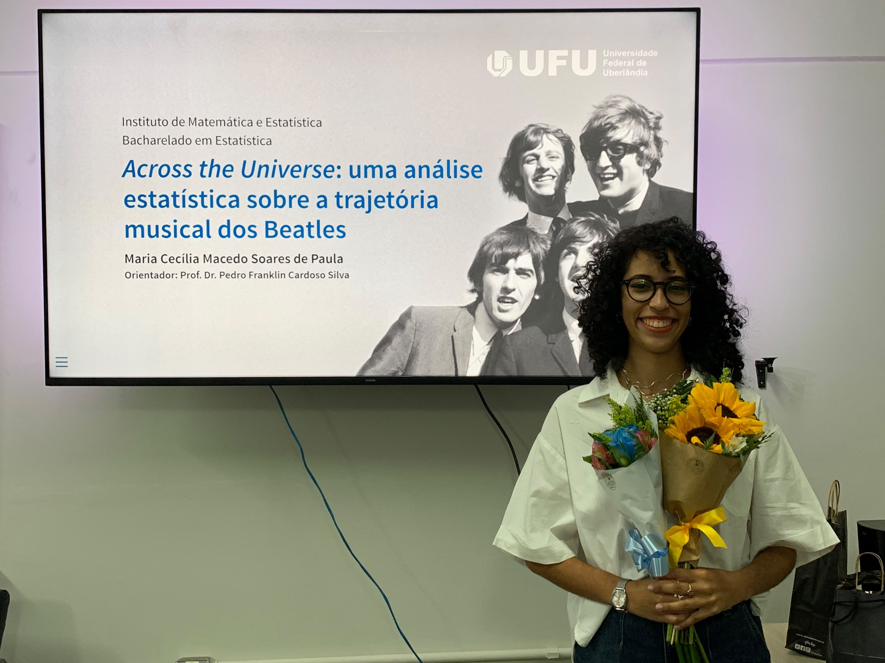
:::

::: {.g-col-6}
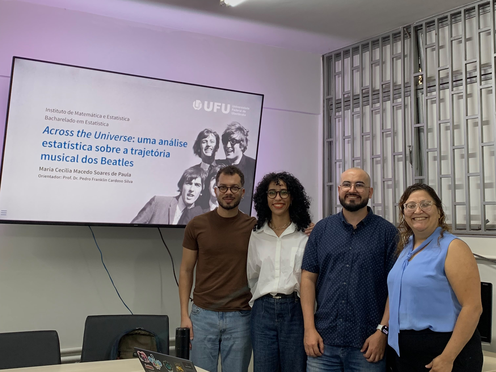
:::
:::

::: {.grid}
::: {.g-col-6}
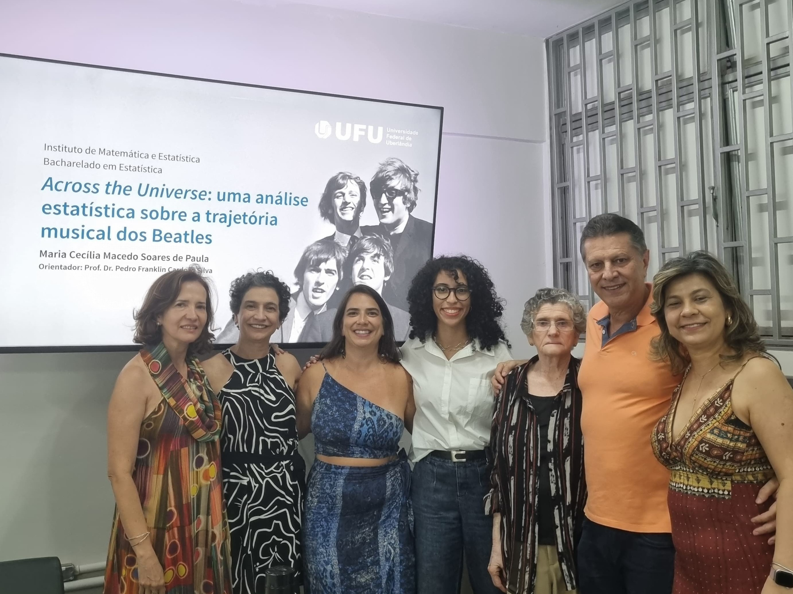
:::

::: {.g-col-6}
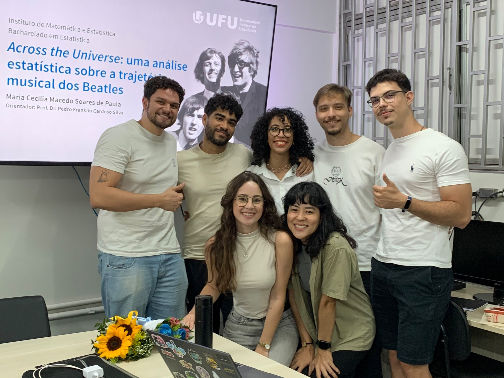
:::
:::

# programanas

o Programanas é um minicurso de programação para mulheres, que busca promover a inclusão e diminuir a disparidade de gênero na área de tecnologia. inicialmente era um curso de introdução a programação em python, porém foi reformulado e passou a ensinar introdução a ciência de dados em R.

ao todo, participei de nove edições do Programanas, sendo a primeira como aluna e as seguintes ministrando e ajudando a elaborar as aulas desse projeto tão especial.

::: {.grid}
::: {.g-col-6}
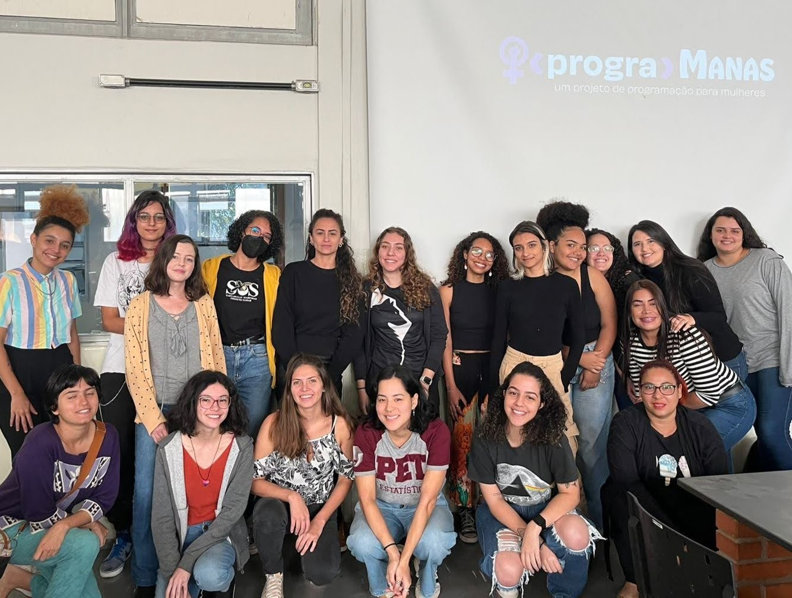
:::

::: {.g-col-6}
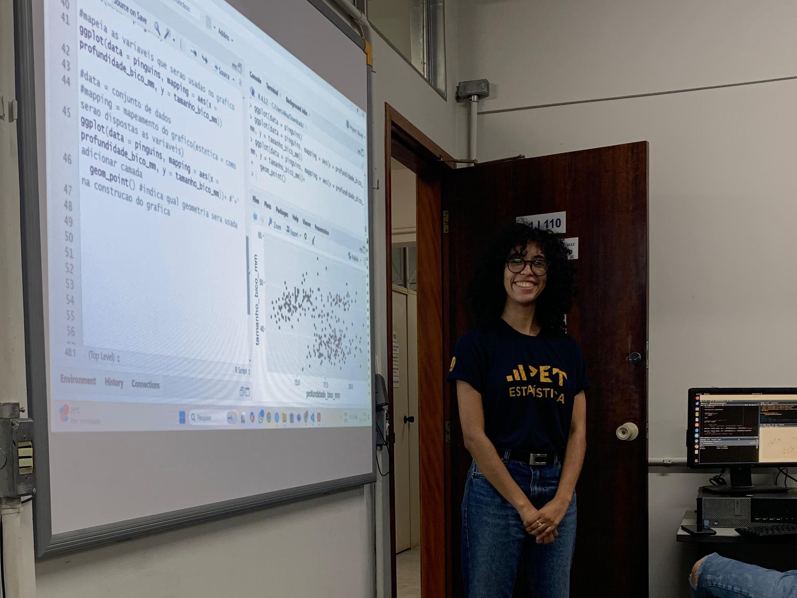
:::
:::

::: {.grid}
::: {.g-col-6}
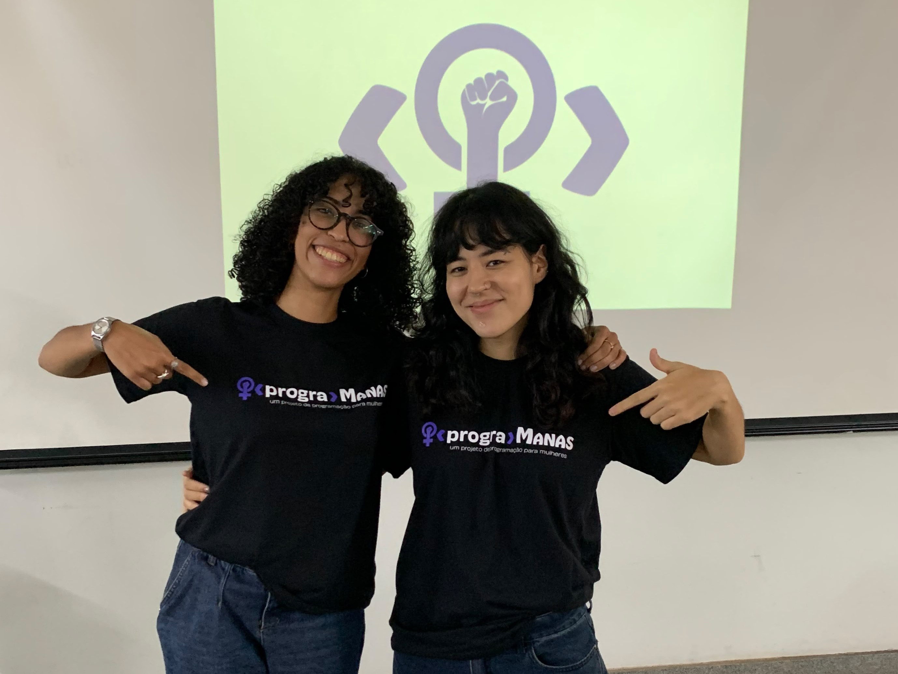
:::

::: {.g-col-6}
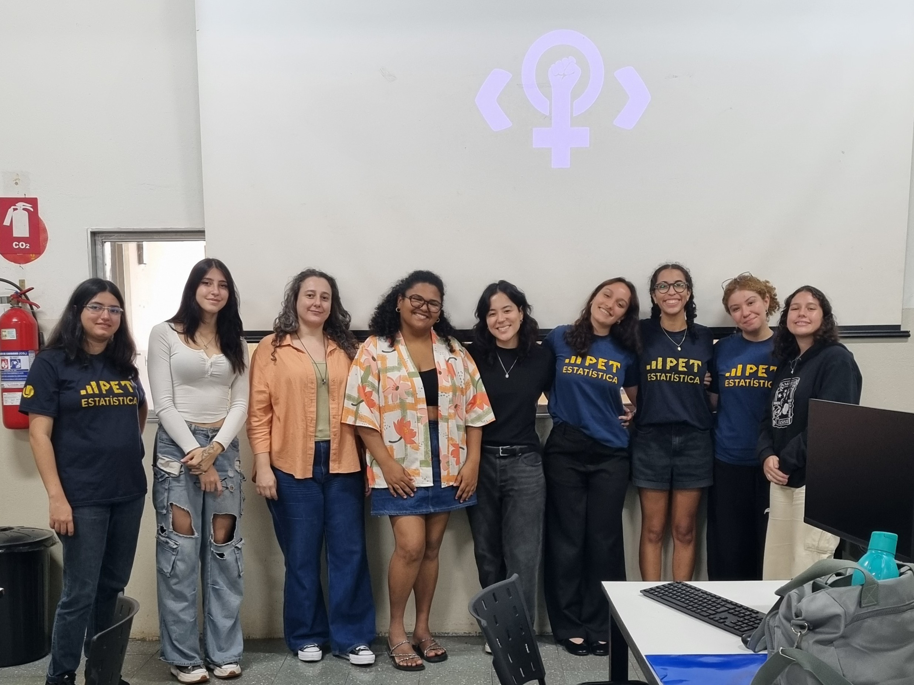
:::

:::

# XI workshop on probabilistic and statistical methods

apresentei os primeiros resultados de meu trabalho de conclusão de curso (TCC) em São Carlos num evento organizado pelo PIPGEs, o Programa Interinstitucional de Pós-Graduação em Estatística da UFSCar e USP.

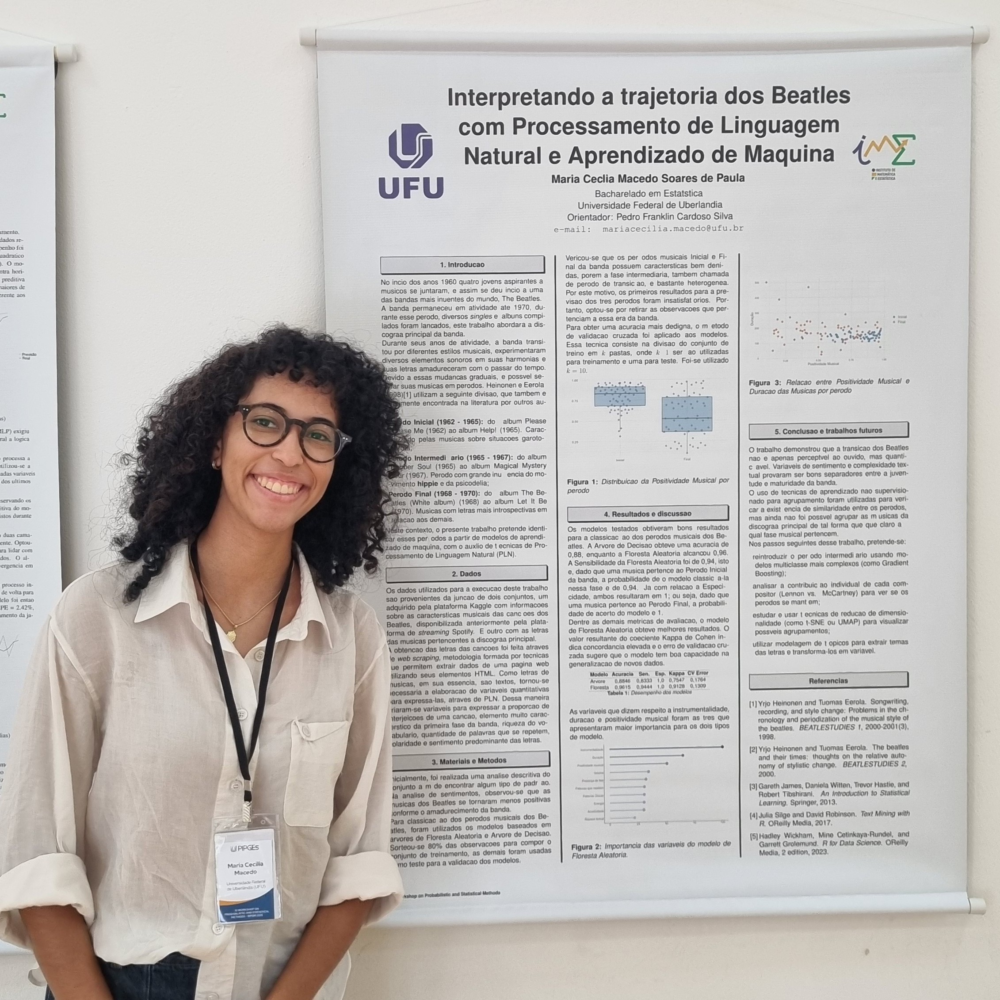{width=50% fig-align="center"}

# semana da estatística - UFU

desde de o início de minha graduação, participei de quatro Semanas da Estatística. na primeira fui apenas ouvinte, porém nos anos seguintes apresentei trabalhos orais e na XV Semana da Estatística ministrei, juntamente com dois colegas, o minicurso do evento.

## apresentações orais

os dois trabalhos que apresentei na semana da estatística foram colaborações entre Elisa e eu. a primeira estudamos as canções da cantora Phoebe Bridgers e analisamos seus sentimentos. é possível ler esse trabalho [aqui](posts/phoebe/phoebe.qmd).

::: {.grid}
::: {.g-col-6}
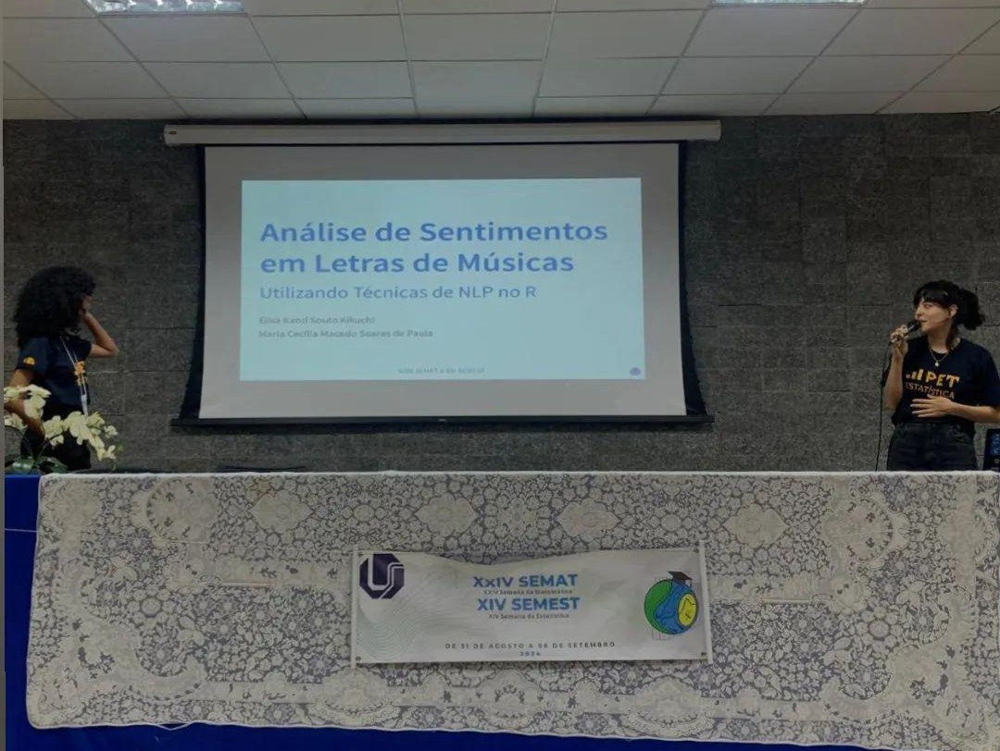
:::

::: {.g-col-6}
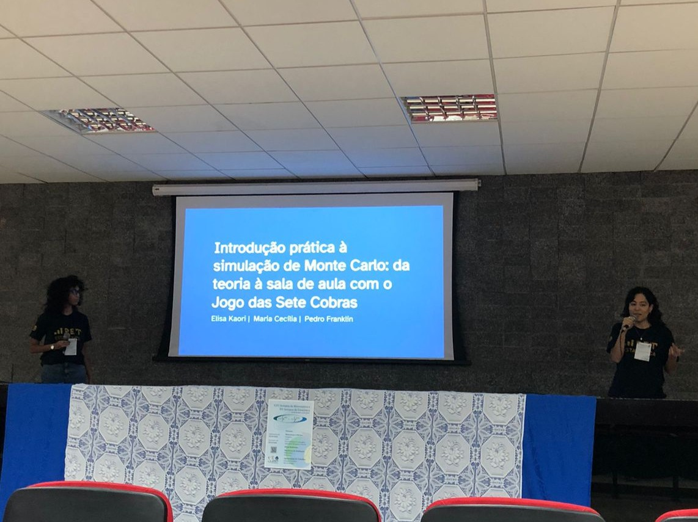
:::
:::

## era uma vez um algoritmo

o minicurso *Era uma vez um algoritmo: uma introdução ao Processamento de Linguagem Natural* integrou a programação da XV Semana da Estatística. nele trabalhamos com as falas dos filmes de Toy Story e comparamos o arco emocional dos quatro longas da franquia.

::: {.grid}
::: {.g-col-6}
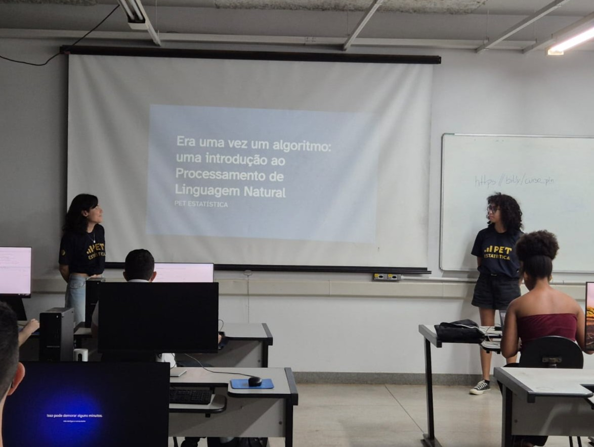
:::

::: {.g-col-6}
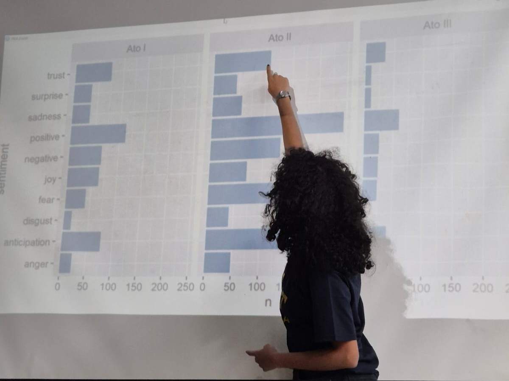
:::
:::

# II reunião mineira de matemática - UFMG

fui para Belo Horizonte em 2023 apresentar o pôster *"Construindo o modelo hipergeométrico negativo através de urnas"*, fruto da minha primeira Iniciação Científica, na *II Reunião Mineira de Matemática* da Universidade Federal de Minas Gerais.

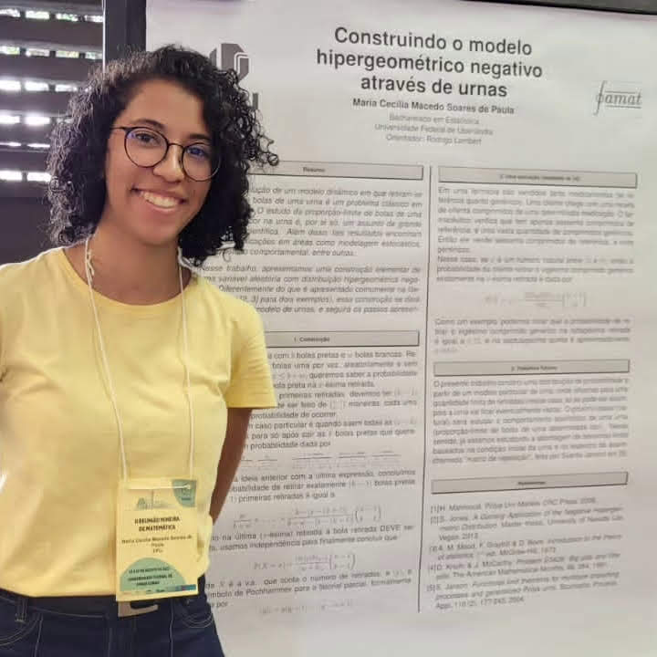{width=40% fig-align="center"}