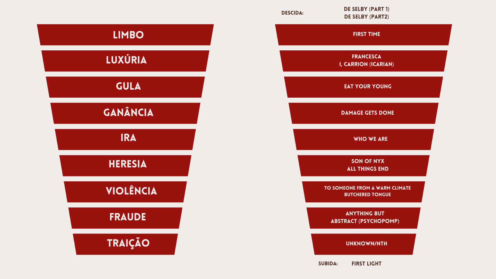

# Contextualização

*Unreal Unearth* é o terceiro álbum de estúdio do artista irlandês Hozier. Lançado em agosto de 2023, o disco conta com 16 faixas, originalmente, que têm como inspiração pricipal a primeira parte do poema épico *A Divina Comédia* de Dante Alighieri.

As faixas do álbum acompanham a jornada de purificação e autoconhecimento de Dante através dos nove círculos do inferno para assim então encontrar a salvação divina e reencontrar-se com sua amada Beatrice no Paraíso.

{fig-align="center"}

# Objetivo

```{r}
#| label: setup
#| echo: false
#| warning: false

library(dplyr)
library(rvest)
library(stringr)
library(tidytext) 
library(ggplot2)
library(SnowballC)
library(textdata)
library(tidyr)
library(wordcloud)
library(wesanderson)
library(knitr)

hozier <- read.csv("unreal_unearth.csv", header = TRUE)

hozier <- hozier[,-1]
```

O objetivo deste projeto é utilizar técnicas de Processamento de Linguagem Natural aprendidas no grupo de estudos do PET Eststística em todas as músicas do álbum *Unreal Unearth* e analisar quais sentimentos prevalentes em cada círculo do Inferno de Dante para entender se a jornada escrita pelo ponto de vista de Hozier se torna mais negativa, devido ao seu percurso ou mais positiva, devido ao narrador estar cada vez mais próximo de sua amada, apesar da jornada.

# Análise

As letras das canções foram obtidas através de *web scraping*. Para entender o comportamento, optei por uma abordagem binária para resumir os sentimento de cada música. Isso é possível de ser fazer com a utilização dos dicionários léxicos Bing e Afinn, o primeiro classifica uma palavra em positivo e negativo, já o segundo atribui um valor inteiro entre -5 e 5.

```{r}
#| label: pln
#| echo: false
#| warning: false
#| fig-width: 12
#| fig-height: 6

musica_instrumental <- data.frame(musicas = "Son Of Nyx", sentimento = 0)

bing <- hozier|>
  unnest_tokens(output = word, input = letras, token = "words")|>
  inner_join(get_sentiments("bing"))|>
  count(musicas, sentiment)|>
  spread(sentiment, n, fill = 0)|>
  mutate(sentimento = positive - negative)|>
  select(musicas, sentimento)|>
  bind_rows(musica_instrumental)

afinn <- hozier|>
  unnest_tokens(output = word, input = letras, token = "words")|>
  inner_join(get_sentiments("afinn"))|>
  group_by(musicas)|>
  summarise(sentimento = sum(value))|>
  bind_rows(musica_instrumental)

df <- data.frame(musicas = c(bing$musicas, afinn$musicas),
           sentimento = c(bing$sentimento, afinn$sentimento),
           dicionario = c(rep("Bing", nrow(bing)),
                          rep("Afinn", nrow(afinn))))

unreal_unearth <- hozier$musicas

df|>
  mutate(musicas = factor(df$musicas, levels = rev(unreal_unearth)))|>
  mutate(dicionario = factor(df$dicionario, levels = c("Bing", "Afinn")))|>
  ggplot(aes(x = sentimento, y = musicas))+
  geom_col(fill = "#9b120f")+
  labs(x = "", y = "")+
  facet_wrap(~ dicionario)+
  theme_classic()+
  theme(strip.background = element_blank(),
        strip.text = element_text(color = "grey40"),
        axis.text = element_text(color = "grey40", size = 9),
        axis.line = element_line(color = "grey60"),
        axis.ticks = element_blank())
```

# Conclusões

O sentimento das músicas é variado, me parece que a jornada começa positiva, durante seu percurso se torna mais negativa devido aos percalços enfrentados, porém quando chega perto de seu fim, a esperança ressusge e torna-se positiva outra vez.

Existe uma diferença nítida entre os dicionários, principalmente na escala dos sentimentos, o que era esperado uma vez que no segundo dicionário a polaridade das músicas tem uma amplitude muito maior que a do primeiro. Porém, grande parte das músicas mantiveram a mesma polaridade geral (poisitiva e negativa) entre os dois dicionários, com exeção das canções *I, Carrion (Icarian)*, *Damage Gets Done*, *Who We Are*, *To Someone From a Warm Climate (Uiscefhuarithe)* e *Butchered Tongue*, sendo a primeira e *Who We Are* as com maior diferença em proporção entre os dicionários.

